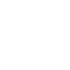

# Simple GoLang Ray Tracer

## Introduction

Welcome to the Simple GoLang Ray Tracer project! This ray tracer is a basic yet powerful tool for creating 3D rendered images using the Go programming language. It's designed to be easy to understand and modify, making it a great starting point for those interested in learning about ray tracing algorithms.

During the development of this project I am going to submit my step by step progress report at the end of this readme file.

## Features

- Basic ray tracing functionalities
- Support for multiple geometric shapes
- Simple lighting and shading models
- Customizable camera settings

## Installation

To use this ray tracer, you need to have Go installed on your machine. [Download Go](https://golang.org/dl/) if you haven't already.

Clone this repository to your local machine using:

```bash
git clone https://github.com/TheGreatDaniad/go-tracer
cd go-tracer
go run .
```

## Progress

_Dec 20, 2023_

first render is done. With ony one sphere and a camera pointing at it, I get only a diagonal line as the result in output image, which is obviously wrong.


