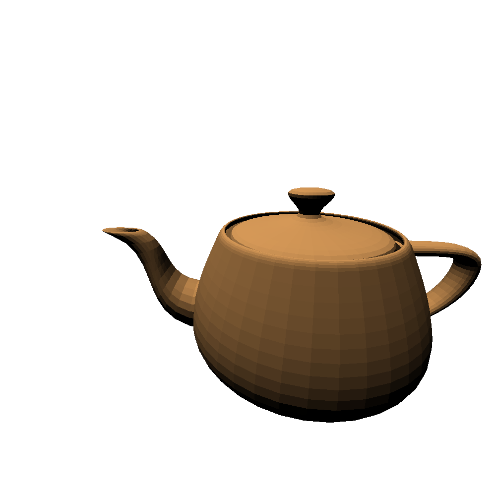

# Simple GoLang Ray Tracer

## Introduction

Welcome to the Simple GoLang Ray Tracer project! This ray tracer is a basic yet powerful tool for creating 3D rendered images using the Go programming language. It's designed to be easy to understand and modify, making it a great starting point for those interested in learning about ray tracing algorithms.

During the development of this project I am going to submit my step by step progress report at the end of this readme file.

## Features

- Basic ray tracing functionalities
- Support for multiple geometric shapes
- Simple lighting and shading models
- Customizable camera settings

## Installation

To use this ray tracer, you need to have Go installed on your machine. [Download Go](https://golang.org/dl/) if you haven't already.

Clone this repository to your local machine using:

```bash
git clone https://github.com/TheGreatDaniad/go-tracer
cd go-tracer
go run .
```

## Progress

_Dec 19, 2023_

first render is done. With ony one sphere and a camera pointing at it, I get only a diagonal line as the result in output image, which is obviously wrong.


_Dec 20, 2023_

found the bug in the code. It was related to calculation of ray directions for each pixel.


_Dec 23, 2023_

Added basic light model (omni light) and a very basic shading based on lambertian shading model
which calculate the color of the surface based on the surface normal and light direction


_Dec 29, 2023_

Totally changed geometery representation to comply with standard formats, added .obj 3D file support.
if the face normals are not present in obj file they are automatically calculated.
Now the engine can render more complex 3d model by importing them as standard obj files.


_Dec 30, 2023_

Tried to apply smooth shading based on Phong shading metho, but something is not right.
in this method the lighting of each point is calculated based on an interpolation of face normal in comparison with the point and creates an illusion of smoothness.

